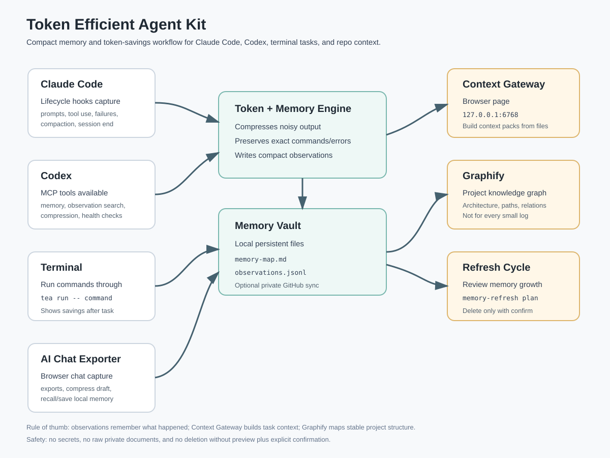

# Plain-English User Guide

This kit helps AI tools waste fewer tokens and remember useful work.

For command-by-command usage of each block, see `docs/STEP_BY_STEP_BLOCK_GUIDE.md`.

It is a small system:

- **Token saver**: compresses long prompts, logs, and notes.
- **Cache helper**: keeps repeated context first and current-task details last, so cloud caching has a better chance to work.
- **Memory vault**: stores useful facts and decisions locally.
- **AI Chat Exporter**: browser extension for exporting ChatGPT/Claude chats and using compression/memory buttons.
- **Observations**: compact automatic task notes.
- **Session rollover**: makes a compact next-chat handoff when a chat gets long.
- **Limit reset wake**: prepares a resume prompt when Claude says a limit resets later.
- **Claude hooks**: automatic capture in Claude Code.
- **Codex MCP tools**: memory and compression tools available inside Codex.
- **Context Gateway**: browser page for building context packs from repo files.
- **Graphify**: project map for architecture and code relationships.



## The Three Product Folders

When someone downloads the repo, they should see three main product pieces:

```text
<CRISP_HOME>
  token engine files: cli, mcp-server, bridge, skill, adapters
  memory-vault: local memory home
  ai-chat-exporter: browser extension
```

Analogy: **a phone, contacts book, and camera roll.**

- The token engine is the phone: it runs the calls and keeps communication short.
- The memory vault is the contacts book: it remembers useful names, decisions, and project facts.
- AI Chat Exporter is the camera roll/scanner: it captures browser chat content and can send compact notes into memory.

Private memory still stays private. GitHub includes `memory-vault/README.md` so the folder is visible, but actual memory files remain ignored unless you intentionally sync them to a private memory repo.

## The Infographic, Explained Like A Product Tour

### Claude Code

Analogy: **a meeting assistant sitting in the room.**

When you work in Claude Code, the hooks notice important moments: when a session starts, when you submit a prompt, when tools run, when something fails, and when the session ends.

Example: You ask Claude to fix a test. The hook stores a short note like:

```text
Claude Code used tool, project=token-kit, task=fix tests, status=done
```

It does not need to store the whole conversation.

### Codex

Analogy: **a toolbox with a notebook built in.**

Codex gets MCP tools for compression and memory. The agent can search prior observations, save a compact decision, and check memory size.

Example: Before changing code, Codex can search:

```text
observe_search "memory automation"
```

Then it recalls only a few useful facts instead of reading everything.

### Terminal

Analogy: **a receipt printer for command work.**

When you run a command through `tea run`, it prints the normal command result and then prints a small receipt: token estimate, exit code, and observation ID.

Example:

```powershell
node <CRISP_HOME>\cli\tea.js run --label "tests" -- npm test
```

### Cache Helper

Analogy: **reusing the same textbook pages and only swapping today's worksheet.**

Cloud AI systems can sometimes reuse repeated prompt context. The trick is to keep the reusable part first and unchanged, then put the new task at the end.

Build one cache-friendly prompt:

```powershell
node <CRISP_HOME>\cli\tea.js cache-prompt build stable.md task.md --out prompt.cache.md --key token-kit
```

Split an existing prompt:

```powershell
node <CRISP_HOME>\cli\tea.js cache-prompt split prompt.md --out-dir prompt-cache
```

Important: this improves layout. The actual cache hit happens in the cloud host, and the proof is visible only when usage shows cache-read or cached-token fields.

### Token + Memory Engine

Analogy: **a smart summarizer.**

It looks at noisy text and keeps what matters: paths, commands, errors, dates, IDs, file names, and decisions.

Example: A 500-line error log becomes a compact summary with the failure line, command, and exact file path.

### Memory Vault

Analogy: **the product notebook and filing cabinet.**

The vault now lives inside the product folder:

```text
<CRISP_HOME>\memory-vault
```

GitHub includes a safe README for this folder, but private local memory files do not get pushed by accident.

### AI Chat Exporter

Analogy: **a browser-side scanner and export button.**

It lives here:

```text
<CRISP_HOME>\ai-chat-exporter
```

It exports ChatGPT/Claude/local AI chats to PDF, Word-compatible DOC, HTML, and Markdown. It also includes the token compression script, so browser prompts can be compressed before you send them.

Example: You write a long prompt in ChatGPT. Click `Compress Draft`. It replaces the draft with a shorter preview. You review it, then decide whether to send.

### Context Gateway

Analogy: **a librarian who builds a small reading packet.**

You point it at a repo, ask a question, and it gives you the most relevant file snippets.

Example: Ask `how does memory automation work`, and it returns the files and snippets most likely to help.

### Graphify

Analogy: **a city map of the codebase.**

Use it when you need architecture, relationships, and paths between concepts. Do not use it for every small log.

Example: Use Graphify to answer: "Which files connect the MCP server to the memory vault?"

### Refresh Cycle

Analogy: **spring cleaning, with your approval.**

The kit can show old memory candidates, but it does not delete them unless you explicitly confirm.

Example:

```powershell
node <CRISP_HOME>\cli\tea.js memory-refresh plan --days 365
```

### Session Rollover

Analogy: **a clean handoff note before moving to the next meeting room.**

Claude Code tracks user prompt count and estimated prompt tokens. Around 12 user prompts, or after an optional token threshold, it saves a compact handoff, keeps the current task running, and asks whether to continue in a fresh chat only after the task reaches a natural stopping point. The next chat should be opened in the same project/workspace and cwd/repo unless you ask to move it.

Example handoff folder:

```text
<CRISP_HOME>\memory-vault\session-handoffs
```

It also reminds Claude to ask for a project label at the beginning, because memory is easier to search when every note belongs to a project.

Example token threshold:

```powershell
$env:TEA_ROLLOVER_TOKENS='6000'
```

### Limit Reset Wake

Analogy: **an alarm clock with your notes already on the desk.**

When Claude Code reports a usage limit and includes a reset time, the hook saves a handoff and schedules a wake plan. A Windows watcher checks wake plans every minute. When the reset time arrives, it copies the resume prompt to your clipboard and writes a copy here:

```text
<CRISP_HOME>\memory-vault\wake-due
```

Install the watcher once:

```powershell
<CRISP_HOME>\adapters\windows\install-wake-task.ps1
```

Check it:

```powershell
node <CRISP_HOME>\cli\tea.js wake status
```

It does not auto-type into Claude. It gives you the exact handoff prompt when the reset window has passed.

## What Happens Automatically

Claude Code has lifecycle hooks installed. It can automatically record compact observations for session start, prompt submit, tool use, tool failure, task completion, compaction, and session end.

Codex has the `token-efficient-agent` MCP server configured. Codex can use `observe_add`, `observe_search`, `memory_health`, and compression tools from normal work.

Plain truth: Claude has real lifecycle hooks. Codex is automatic through instructions, MCP tools, and the Codex `notify` adapter when configured. Codex turn rollover can be automatic; exact prompt-token rollover needs the notify payload or workflow to provide prompt/message text.

## Memory Vault Merge

We merged the memory vault into the product locally.

Old shape (the standalone `agent-memory-vault` repo — retired, folded in below):

```text
<old TEA install>
<old agent-memory-vault repo, now retired>
```

New shape:

```text
<CRISP_HOME>
<CRISP_HOME>\memory-vault
```

This is easier to understand: one product folder contains the token tool and its local memory home. (The browser chat exporter is a separate, unrelated project — not part of this package.)

Important safety detail: the public/product GitHub repo gets the code, templates, exporter, and memory-vault placeholder, but not your private memory contents.

## Run A Command With Token Savings

```powershell
node <CRISP_HOME>\cli\tea.js run --label "test run" -- npm test
```

It runs the command, prints normal output, prints estimated token savings, saves a compact observation, and preserves the command exit code. It does not store raw stdout or stderr.

## Save And Search Memory

```powershell
node <CRISP_HOME>\cli\tea.js observe add "Context Gateway should stay CPU-first" --type decision --project token-kit
node <CRISP_HOME>\cli\tea.js observe search "CPU-first"
node <CRISP_HOME>\cli\tea.js observe timeline obs_...
```

Memory now lives here:

```text
<CRISP_HOME>\memory-vault
```

Important files:

```text
memory-map.md
observations.jsonl
```

## Use Graphify

Use Graphify for bigger repo understanding: architecture, file relationships, dependency paths, and "what connects to what?"

Do not use Graphify for every small command log. Daily task events go into observations. Stable repo structure goes into Graphify.

## Review Token Savings

```powershell
node <CRISP_HOME>\cli\tea.js stats
node <CRISP_HOME>\cli\tea.js gain
```

## Review Memory Growth

```powershell
node <CRISP_HOME>\cli\tea.js memory-health
node <CRISP_HOME>\cli\tea.js memory-refresh plan --days 365
```

Delete only after review:

```powershell
node <CRISP_HOME>\cli\tea.js memory-refresh prune --days 365 --confirm
```

The prune command creates a backup first.

## Step-By-Step Starter Workflow

### Step 1: Check That Memory Is Healthy

```powershell
node <CRISP_HOME>\cli\tea.js memory-health
```

Expected result: you see the vault path, number of observations, oldest item, newest item, and old-memory count.

### Step 2: Save One Test Memory

```powershell
node <CRISP_HOME>\cli\tea.js observe add "Test memory: token kit uses local memory-vault inside the product folder" --type test --project token-kit
```

Expected result: it prints an `obs_...` ID.

### Step 3: Search That Memory

```powershell
node <CRISP_HOME>\cli\tea.js observe search "product folder"
```

Expected result: it finds the test memory.

### Step 4: Run A Command With Token Metrics

```powershell
node <CRISP_HOME>\cli\tea.js run --label "hello smoke" -- powershell -NoProfile -Command "Write-Output hello"
```

Expected result: it prints `hello`, then token metrics and an observation ID.

### Step 5: Use The Browser Context Gateway

Open:

```text
http://127.0.0.1:6768/
```

Index:

```text
<CRISP_HOME>
```

Ask:

```text
how does memory automation work
```

Expected result: it builds a compact context pack you can paste into an AI chat.

### Step 6: Install AI Chat Exporter

Open Chrome:

```text
chrome://extensions
```

Then:

1. Turn on `Developer mode`.
2. Click `Load unpacked`.
3. Select:

```text
<CRISP_HOME>\ai-chat-exporter
```

Expected result: the extension appears in Chrome. Refresh ChatGPT or Claude, then use the floating exporter panel.

### Step 7: Optional Browser Memory/Compression Bridge

Start the local bridge:

```powershell
node <CRISP_HOME>\cli\tea.js bridge start
```

Expected result: AI Chat Exporter can use local compression and memory buttons through `http://127.0.0.1:6768`.

### Step 8: Review Old Memory Before Cleanup

```powershell
node <CRISP_HOME>\cli\tea.js memory-refresh plan --days 365
```

Expected result: it previews old observations. Nothing is deleted.

### Step 9: Delete Only If You Approve

```powershell
node <CRISP_HOME>\cli\tea.js memory-refresh prune --days 365 --confirm
```

Expected result: it creates a backup, then removes old observations.

## Mental Model

```text
Token saver      = makes text smaller
Cache helper     = keeps repeated context stable
Memory vault     = remembers useful facts
Observations     = compact task diary
Limit reset wake = alarm plus resume prompt
Context Gateway  = builds context packs from files
Graphify         = maps repo structure
Claude hooks     = automatic capture in Claude Code
Codex MCP        = memory/compression tools for Codex
```

## Safety Rules

- Do not save secrets.
- Do not store raw private documents.
- Do not delete memory without first running a plan.
- Keep recalled memory small.
- Use Graphify for project maps, not every log line.
